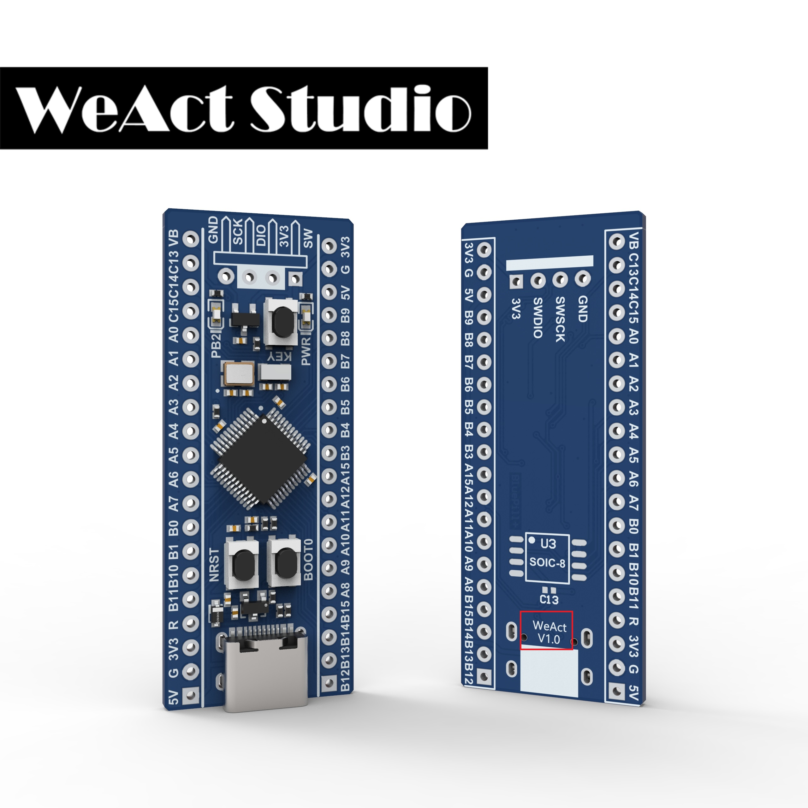

# BluePill Plus  / WeAct Studio 微行工作室 出品

* [Enlish version](./README.md)

> STM32F103C8T6
* 72Mhz,20KB RAM,64KB ROM
> STM32F103CBT6
* 72Mhz,20KB RAM,128KB ROM
> GD32F303CCT6
* 120Mhz,48KB RAM,256KB ROM

> 无铅工艺

> 可用与Arduino开发(提供bootloader, 只有STM32F103CxT6支持)

## 购买链接

### 淘宝购买链接
[WeAct Studio官方店](https://shop118454188.taobao.com/index.htm?spm=2013.1.w5002-17867322799.2.212f5cb16nqwNP)

### 速卖通购买链接
[WeAct Studio Official Store](https://weactstudio.aliexpress.com/)  
[WeAct Studio One Store](https://www.aliexpress.com/store/1104927695)

## 特性

* STM32F103C8T6 ARM Cortex M3
+ `72 MHz` 最大频率，1.25 DMIPS/MHz (Dhrystone 2.1)，0等待内存访问
+ `64 Kbytes` 的Flash, `20 Kbytes`的SRAM
* GD32F303CCT6 ARM Cortex M4
+ `120 MHz` maximum frequency,performance at 0 wait state memory access
+ `256 Kbytes` of Flash memory, `48 Kbytes` of SRAM
* `8 MHz` 系统晶振
* `32.768 KHz` RTC晶振
* 蓝色 LED `PB2` Active high
* 红色电源 LED `PWR`
* 2x20 侧面引脚 && 1x4 SW 引脚
* 尺寸: `52.81 mm x 20.78 mm`

* SPI Flash U3 IO位置
  * PA4  CS
  * PA6  MISO
  * PA7  MOSI
  * PA5  SCK
* USB C
  * PA11  USB_DN
  * PA12  USB_DP

|目录名称|内容|
| :--:|:--:|
|Doc| 数据手册/参考手册|
|HDK| 硬件开发资料|
|SDK|软件开发资料|
