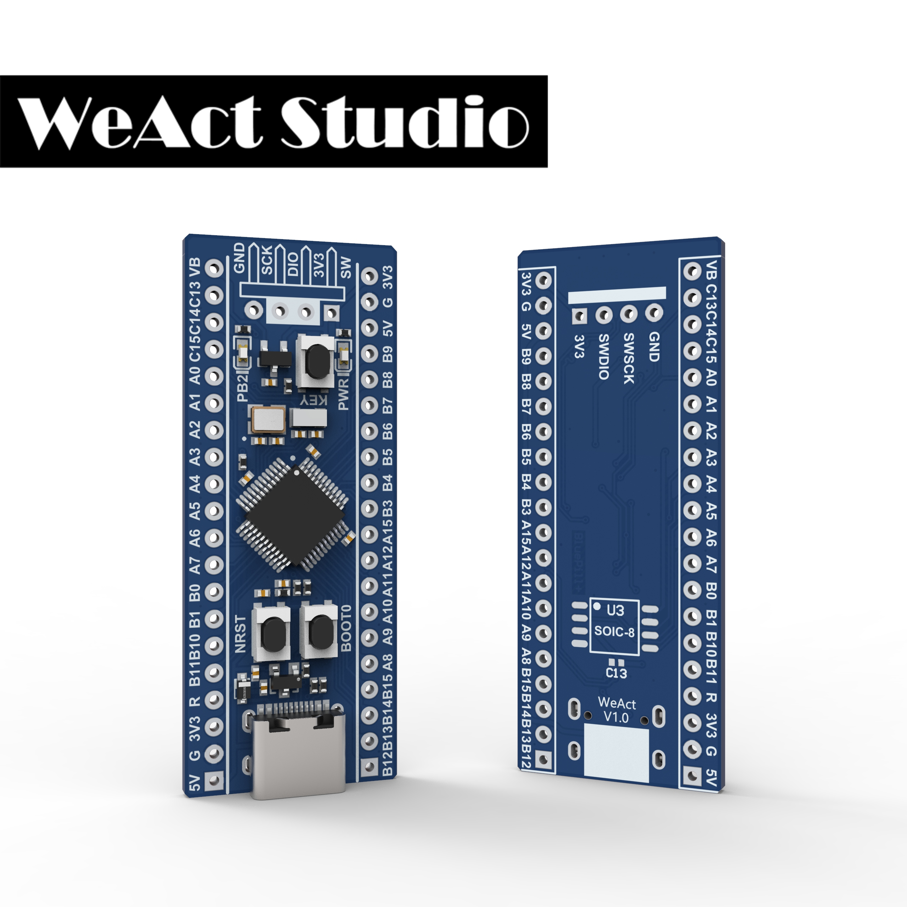

# BluePill Plus
> STM32F103C8T6

> 72Mhz,20KB RAM,64KB ROM

## Features 特性
* STM32F103C8T6 ARM Cortex M3
+ `72 MHz` maximum frequency,1.25 DMIPS/MHz (Dhrystone 2.1) performance at 0 wait state memory access
+ `64 Kbytes` of Flash memory, `20 Kbytes` of SRAM
* `8 MHz` system crystal
* `32.768 KHz` RTC crystal
* Blue LED `PB2` Active high
* Red power LED `PWR`
* 2x20 side pins && 1x4 SW pins
* Size: `52.81 mm x 20.78 mm`

* SPI Flash U3 Un place
   + PA4  CS
   + PA6  MISO
   + PA7  MOSI
   + PA5  SCK
* USB C
   + PA11  USB_DN
   + PA12  USB_DP

|Dir Name|Explain|
| :--:|:--:|
|Doc|DataSheet/ReferenceManual 数据手册/参考手册|
|HDK|Hardware Development Kit 硬件开发资料|
|SDK|Software Development Kit 软件开发资料|